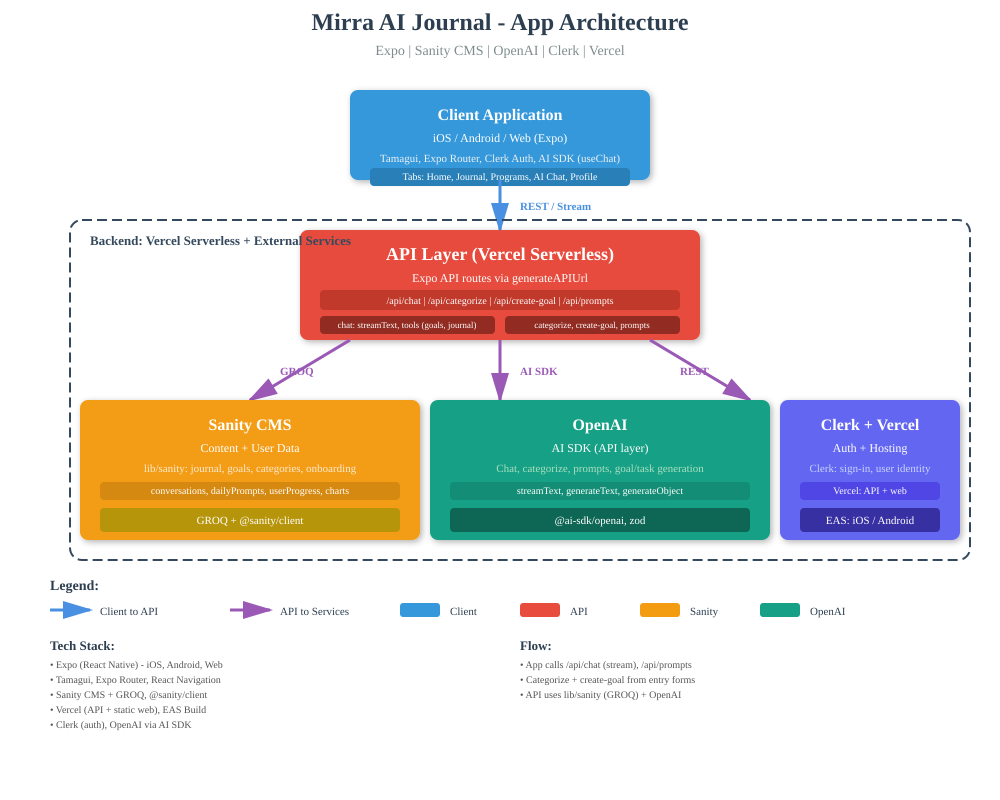
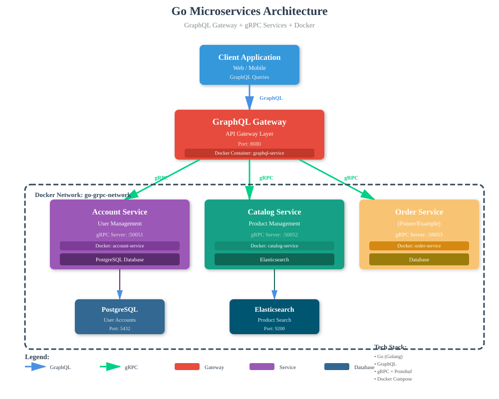

# Josh Bedo

**Senior Full-Stack Engineer** · NYC -> Erie, PA  
Designing and scaling production systems -> from APIs and data pipelines to polished UIs.

🟢 **Open to opportunities** · [Resume](resume/josh-bedo-resume.pdf) · [LinkedIn](https://www.linkedin.com/in/josh-bedo-2bb2ab34/) · [X](https://x.com/joshbedo)

---

## 👋 About Me

I’m a full-stack engineer with a product mindset and a strong bias toward **clarity, reliability, and maintainability**.

I’ve spent my career designing, shipping, and evolving production systems - especially ones that have outgrown their original architecture.

I care a lot about:
- clean APIs and thoughtful abstractions  
- software that’s easy for *others* to work on  
- balancing speed with long-term maintainability 
- building cool stuff people love to use 

---

## 🛠️ Recent Projects

### **Mirra** — AI Journaling & Life Coach App

An AI-powered journaling app that transforms self-reflection into meaningful insights and actionable goals. Mirra helps you set and plan tasks intelligently by analyzing your journal entries, personal programs, and prior achievements.

> **Coming soon:** [Try Mirra](https://mirra.app) · [GitHub](https://github.com/joshbedo/mirra)

  
  &nbsp;&nbsp;
  

<!-- 👉 [Try Mirra](https://mirra.app) · [GitHub](https://github.com/joshbedo/mirra) -->

---

### **Go + gRPC Service Architecture**

A modular backend architecture designed around gRPC to support efficient, strongly-typed communication between distributed services.

Key highlights:
- Clear service boundaries and modular decomposition  
- gRPC + GraphQL API design  
- Emphasis on observability, scalability, and long-term maintainability 

👉 [View repository](https://github.com/joshbedo/go-grpc)

 

---

## 🧠 Experience

I’ve built and maintained systems used by millions at:

**Udacity · Knapsack · Namely · The Daily Beast · Reserve / Resy · PINCHme · JPMorgan Chase · Netflix · Sony · Universal**

My work has spanned:
- greenfield builds and large-scale refactors  
- search and data-model redesigns  
- API and platform tooling  
- AI Agents, Tools, Inference, MCP, Vision, and RAG Pipelines
- performance and reliability improvements  

I’m often brought in to help teams untangle complexity and move faster *without* breaking everything.

---

## 🛠 Tech Stack

**Frontend**  
React · Next.js · Design Systems · Storybook · SSR · Performance Optimization

**Backend**  
Node.js · Go · Python · Ruby on Rails  
GraphQL · REST · gRPC · Background Jobs · Caching · Search

**Infrastructure**  
AWS (ECS, Lambda, CDK, AppSync, DynamoDB)  
Postgres · Redis · RabbitMQ · Docker

---

## 🤝 Let’s Connect

If you’re building something interesting, modernizing something messy, or just want to talk software - feel free to reach out.

[LinkedIn](https://www.linkedin.com/in/josh-bedo-2bb2ab34/) · [X](https://x.com/joshbedo)

